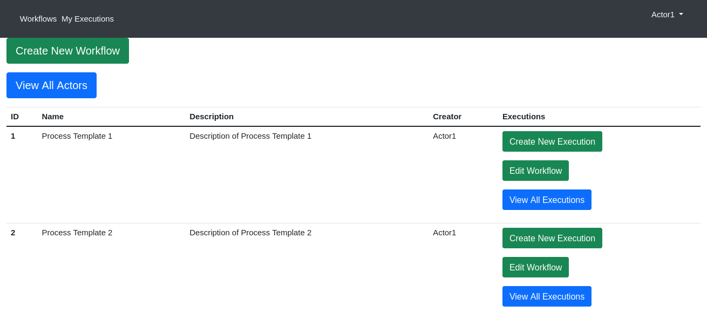
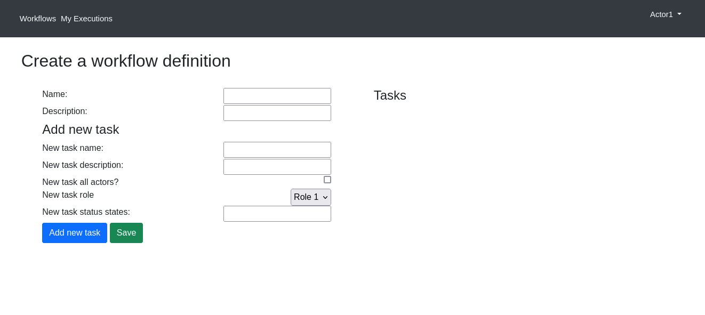
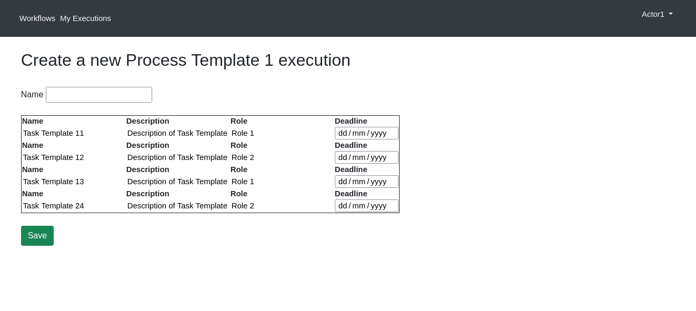
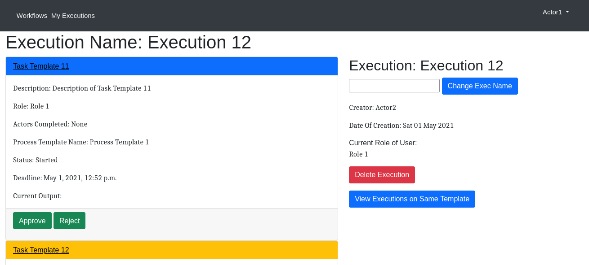
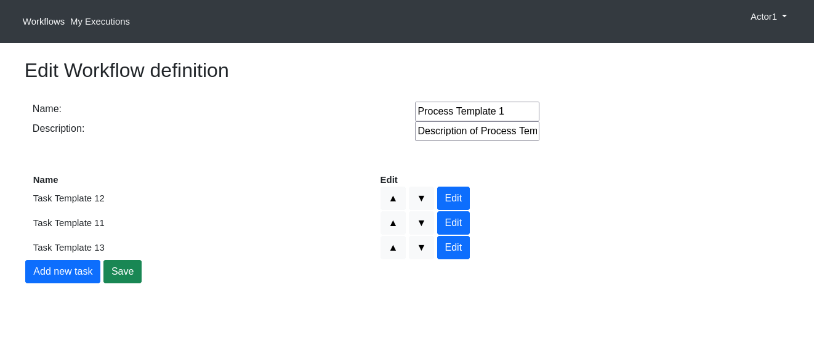
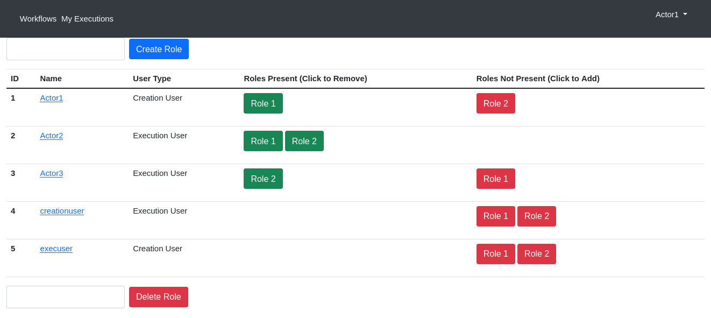
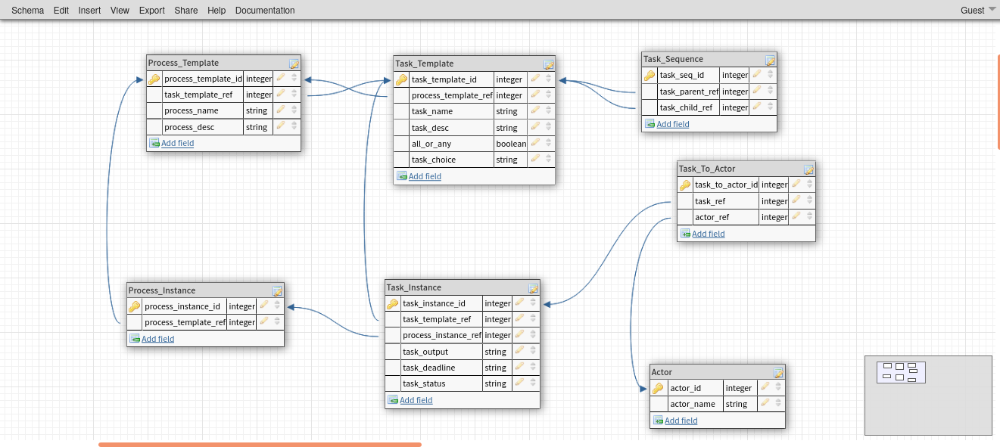

# Workflow Management System
Django application for creating and managing workflows at an abstract level. (Eg. Loan-issuing workflow, Job-application workflow.) Supports multi-user, flexible, and reusable workflows and tasks using templates.

## Images

